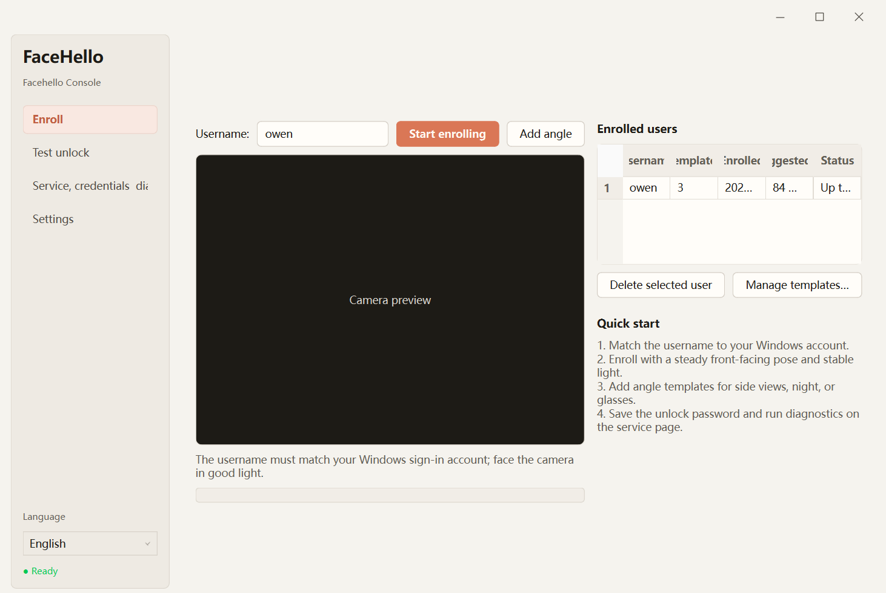

<div align="center">


*Bringing Windows Hello-style face unlock to laptops, desktop front cameras, and USB cameras that Windows Hello doesn't support.*

*Inspired by a Surface Pro 4 the author once owned~*

<br>

[](https://www.microsoft.com/windows)
[](https://www.python.org)
[](./LICENSE)
[](https://github.com/deepinsight/insightface)
[](https://developers.google.com/mediapipe)

**[🇨🇳 中文](./README_zh.md)**　｜　**[📐 Design & Decisions](./DESIGN.md)**

</div>

---

## ⚠️ Safety Notice (read before use)

- This project is only meant for **Windows 10 / 11**; using it on any other OS is not recommended.
- It touches system-affecting operations like modifying Windows services. The author has added plenty of safeguards and validated it on real hardware, but there's still a chance of serious system problems like **being unable to sign in, a service crash, or a BSOD**. The odds are very small, but be aware.
- This project uses vision algorithms like OpenCV to do single-RGB-camera face unlock — i.e. **Windows Hello-like** — but the actual security is far below the real Windows Hello. A single RGB camera can't sense spatial information the way infrared / depth cameras can, and may well be bypassed by a high-quality video or photo. **Do not use this on a work computer that stores sensitive data** — the risk is significant, and you bear the consequences of any major loss yourself.
- The vision recognition runs onnx-model inference on the CPU, which puts some demand on your hardware. From testing, a CPU with fewer than 4 cores is not recommended — inference latency rises noticeably, defeating the fast-unlock spirit of the original Windows Hello.

---  

## 💽Cloud Drive Distribution

Quark Cloud Drive:    
Link: https://pan.quark.cn/s/db1464cf9c2d?pwd=afnw    
Extraction Code: afnw    

---  

## 📋 Requirements

- **Windows 10 / 11 (x64)**
- A working **RGB webcam**
- **A 4-core-or-better CPU**: recognition runs onnx inference on the CPU, and with too few cores unlock latency rises noticeably, defeating the point of a fast unlock
- Some advanced actions (writing the LSA password, installing the service) need an **Administrator** terminal (PowerShell)

---

## 🚀 Install & Use (recommended: the one-click installer)

Regular users don't need Python / uv — just grab the installer from the Release page:

1. Download the latest `FaceHello-Setup-x.y.z.exe` from [Releases](https://github.com/everglow01/Windows-Face-Hello/releases).
2. Right-click **Run as administrator** and complete the wizard. The installer registers the background authentication service and lock-screen Credential Provider, then creates the data directory. Before finishing, it also checks the service, pipe, current-version DLL, log, and face gallery; a failed acceptance check does not silently complete the install.
3. Once installed, open the "FaceHello Console" from the Start menu or desktop (use admin privileges the first time), enroll your face, set your sign-in password, and you can unlock by face at the lock screen.

> The recognition models are all bundled in the installer, so installation does not download them.
>
> Later releases can be installed through the console's update check. Downloads can resume after interruption, and FaceHello rechecks the release metadata, SHA-256, and signature before launching the installer. Upgrades preserve the face gallery and compare the relevant data and Windows sign-in components before and after the upgrade. If configuration or acceptance fails, the installer attempts to restore the previous version. Installation is never silent and never restarts Windows automatically.

**Uninstall**: uninstall via Windows "Settings → Apps" or "Uninstall FaceHello" in the Start menu. The uninstall removes both the program and all local data, leaving no leftover files behind.

---

## 🛠️ Dev Environment

If you want to run the console and service from source, or contribute:

- **Python 3.11** (the project requires `>=3.10,<3.12`)
- [**uv**](https://docs.astral.sh/uv/) (package / virtualenv management)

```powershell
git clone https://github.com/everglow01/Windows-Face-Hello.git
cd Windows-Face-Hello

uv sync                                   # create .venv and install deps (not the base env)
uv run python scripts/offline_check.py    # offline self-check (no camera/display needed); all [ok] = good
uv run python -m app.main                 # launch the console GUI (must use admin privileges on first use)
```

> On first run, models auto-download to `models/`: InsightFace `buffalo_l` (recognition + detection, ~191 MB) and MediaPipe `face_landmarker.task` (liveness, ~3.7 MB).

For detailed developer docs and a contribution guide, see [contribute.md](./contribute.md).

---

## 🖥️ Using the Console

Launch the installed app with admin privileges to enter the console desktop app. On first show, the window expands to fit its content; you can still resize it from any edge or corner, and camera previews keep their aspect ratio as the window changes:



1. **Enroll** — the username defaults to your current Windows account name (the text shown on the lock screen); face the camera to collect several good frames, averaged into a template. The enrolled-users list (view / delete) lives on this tab.
   > The username must equal your Windows sign-in account name, otherwise lock-screen unlock won't match (Microsoft accounts use the local login name).
   > Not sure of your account name? Press Win+L to see the name shown on the lock screen — it's usually the same.
   > 💡 **Tip: enroll more than one template per user.** After the first "Start enrolling", change the **angle, lighting, makeup / hairstyle, glasses on/off**, etc., and click **"Add angle"** to append another template (one username can hold several; unlock automatically takes the most similar one). Enrolling **2+ templates** noticeably improves the unlock success rate across scenarios and reduces occasional misses. The per-user cap is adjustable on the Settings tab.
2. **Test unlock** — follow the random liveness prompt (blink N times / turn left / turn right), then recognition runs and shows the similarity and result.
3. **Settings** — pick the camera (with a **Test** button that previews the selected one, handy on multi-camera machines); tune the match threshold, turn angle, blink count, and recommended re-enrollment interval; toggle **liveness** and **passive anti-spoofing**. Reaching that date only shows a reminder—the template still works for authentication.
4. **Service, credentials & diagnostics** — set the sign-in password used for lock-screen unlock (written to an LSA Secret), install / start / stop the authentication service, and check its version, pipe protocol, and runtime state. **Requires Administrator**, otherwise the relevant buttons are disabled.

*Some stutter on the first enrollment and test is normal.*

*The bottom-right of the GUI shows model-loading status; it's recommended to wait until the models finish loading before enrolling and testing.*

To calibrate liveness thresholds (live EAR / yaw display, prints suggested values on exit):

```powershell
uv run python -m scripts.liveness_tune
```

---

## 🔓 How Lock-screen Unlock Works

Full unlock chain: lock-screen "Face Unlock" tile → (named pipe) → LocalSystem service → InsightFace recognition → read the password saved in the LSA → pack a Kerberos credential to actually unlock. Both local accounts and Microsoft accounts (MSA local login) are verified end-to-end. **Fully validated and working on the author's physical machine.**

> If a face check fails, press the tile's **→** button to try again — you get **3 attempts**, after which Face Hello falls back to password sign-in (the system password / PIN is always available).

Auth service commands (Administrator; `<venv>` = `.venv\Scripts\python.exe`):

```powershell
<venv> winservice_main.py install --startup auto   # register the service, auto-start at boot
<venv> winservice_main.py start | stop | remove     # start / stop / remove
```

You normally don't need to run these by hand — the GUI above can install and start everything in one click; these are for dev/debugging.

If you're developing from source and want to build the C++ Credential Provider (CP) for the lock-screen tile yourself, you'll need VS2022 with "Desktop development with C++", and **build with PowerShell, not Bash** (MSYS mangles the `/p:` arguments):

```powershell
MSBuild.exe cp\FaceHelloCP.sln /p:Configuration=Release /p:Platform=x64
# Output: cp\x64\Release\FaceHelloCP.dll, then register it with regsvr32
```

> ⚠️ Before registering the CP or testing on real hardware, **always** take a system restore point or VM snapshot and keep a spare admin account. This project **never** replaces the system's built-in password / PIN sign-in — the fallback login is always there. More build and troubleshooting details are in [cp/README.md](./cp/README.md).

(Regular users of the one-click installer don't need this step — the DLL is already built and bundled.)

---

## ⚙️ How It Works (in brief)

```
Camera (OpenCV) → Active liveness (MediaPipe FaceLandmarker: EAR blink + solvePnP head turn)
               → Face detection + recognition (InsightFace SCRFD + ArcFace, 512-d embedding)
               → Passive anti-spoofing (Silent-Face MiniFASNet: reject screen / photo / video replay)
               → Cosine similarity vs gallery → pass / reject
```

- The `face_hello/` core library has no GUI dependency and is shared by the console, the service, and scripts.
- At the lock screen, recognition runs in a resident LocalSystem service; the C++ Credential Provider only handles the UI and submits the credential. The two communicate over a local named pipe.

---

## 🖼️ Custom Lock-screen Avatar

You can drop your own avatar image into the default path `C:\ProgramData\FaceHello`. The program takes the **first** image in that directory, scales and crops it to a square, and places it on the lock-screen tile; newer Windows displays it as a circle automatically.

- Supports **PNG / JPG / BMP**; a square image is recommended so the edges aren't cropped.
- A pure-ASCII path — the Credential Provider running as SYSTEM at the lock screen can read it (it can't access OneDrive / Chinese paths).
- If no image is found or decoding fails, the tile falls back to the default solid-blue placeholder without affecting unlock.


## 🔐 Security & Privacy

- The gallery stores **feature vectors, not photos**, encrypted on disk with Windows DPAPI in the local `data/` and never uploaded. Its versioned format is validated when loaded and written via atomic replacement to reduce corruption if a save is interrupted.
- The sign-in password is kept in an **LSA Secret**, read by the Credential Provider itself in the SYSTEM context — it **never travels over IPC**.
- **Passive anti-spoofing** (Silent-Face MiniFASNet) samples several frames during recognition to reject screen / photo / video replays — on by default, with a toggle in Settings. It meaningfully raises the bar, but being single-RGB it is **not** foolproof.
- Even with active liveness + passive anti-spoofing, monocular RGB still can't match IR / depth. **Don't use this on a machine others might physically access.** Any data leak or loss is the result of the user's own operation and of not understanding this project's risks, and you bear the consequences yourself.
- With **liveness** turned off, startup compresses to under 1s for an almost-instant experience — but for safety we still don't recommend turning it off.

---

## 📂 Project Layout

```
face_hello/        core library (no Qt dependency)
  camera.py          camera capture (with cold-boot / wake retries)
  detector.py        InsightFace detection + 512-d embedding
  matcher.py         cosine-similarity matching
  liveness.py        FaceLandmarker → EAR blink + solvePnP turn + random challenge
  antispoof.py       passive anti-spoofing (MiniFASNet + RetinaFace crop)
  enroll.py          multi-frame averaged enrollment
  store.py           DPAPI-encrypted gallery + settings
  auth.py            auth orchestration (liveness → recognition) state machine
  service.py         named-pipe auth server
  win_service.py     LocalSystem Windows service wrapper
  cred_vault.py      LSA Secret read/write (sign-in password)
app/               PySide6 console (main.py + background workers.py)
cp/                C++ Credential Provider (lock-screen tile, needs VS to build)
scripts/           offline_check.py and other tooling
data/              encrypted gallery (gitignored)
models/            model weights (gitignored)
```

---

## 🚧 Known Limitations

- Anti-spoofing: a passive model (MiniFASNet) now rejects most screen / photo / replay attacks, but being single-RGB it isn't foolproof and a determined attacker may still bypass it. Again: do not use this on a computer holding sensitive data.
- The first cold start loads the ~191 MB recognition model from disk, taking a few seconds (about 2s on a modern CPU); after sleep the camera needs a couple of seconds to re-enumerate (retries are built in).
- When the working directory contains Chinese paths, OpenCV / MediaPipe are handled specially, but encoding glitches may still occur.
- The installer and the app itself are fairly large, bounded by the Python-related dependencies.

---

## ❓ FAQ

**Q: In the console app the camera opens and recognizes faces accurately — why does the camera often fail to open after the PC locks or cold-boots, making Face Hello unusable?**      

A: 1. Some USB or built-in laptop cameras *aren't powered* on the lock screen, so OpenCV can't grab the camera — make sure your camera device is powered at the lock screen or on cold boot (just powered on, woken from sleep, etc.). 2. On some laptop brands the camera may be turned off when not on AC power or in power-saving mode — you may need to force it on. 3. Make sure you've enabled camera permission in Windows settings. 4. Make sure the camera isn't occupied by another app on the lock screen. 5. A very few external cameras refuse lock-screen access for security reasons — there's no fix for that but to switch cameras.

**Q: The lock screen shows "service not started" and face unlock doesn't work.**      

A: Open the console as Administrator and check the service on the "Service, credentials & diagnostics" page. Start it if it is stopped. If it says "Running" but the lock screen still fails, run the diagnostics on that page first. They distinguish a service that is not ready from a version mismatch, incompatible protocol, or malformed response. When filing an issue, include the diagnostic result and machine details, but never upload a password, LSA Secret, or face-gallery file.

**Q: Why is my face recognition unstable at the lock screen — Face Hello takes a long time to start and finally fails, yet sometimes it works fine?**     

A: This is indeed a current bug. We've fixed and optimized the slow-start / sometimes-won't-start problems, and on the few machines the author tested the chance of hitting it is extremely low, near zero. If you run into it often, please file an issue so we can look into it. Such a bug can come from a daemon thread not running properly, an unstable camera index, and so on.     

**Q: Why can't I use Face Hello after restarting my computer following a Windows update?**      

A: This is normal. Windows updates typically refresh Windows services, which may cause the Face Hello service to hang. After unlocking the system with your password, the service will resume the next time you lock the screen. You don't need to run the service again in the console.

**Q: Why does the update check show different failure messages?**

A: The console distinguishes an already-current installation from a local network failure, a temporary GitHub error or rate limit, invalid release metadata, an unsupported update manifest, insufficient disk space, an invalid download response, a failed installer hash / signature check, and a paused download. Follow the specific message; an installer that fails verification will not run.

**Q: Will an upgrade erase enrolled faces?**

A: A normal upgrade preserves the gallery under `C:\ProgramData\FaceHello\data`. Before changing the service or lock-screen component, the installer writes a temporary baseline containing only hashes and counts, then compares it after the upgrade. It contains no usernames, face embeddings, Windows passwords, or LSA Secrets. The baseline is deleted after successful acceptance; on failure it is retained while the installer attempts to restore the previous version.

## 📝 TODO

1. Optimize startup speed, model-loading speed, service-startup speed (OpenCV DNN)
2. Polish or refactor the PySide6 frontend
3. Further improve security, including the login credential and single-RGB protection
4. Detailed usage docs (?)
5. GPU inference support

## 📄 License

Apache-2.0 (see LICENSE); due to the bundled InsightFace model being limited to non-commercial use, this distribution is for non-commercial purposes only. See THIRD_PARTY_LICENSES.md for details.
