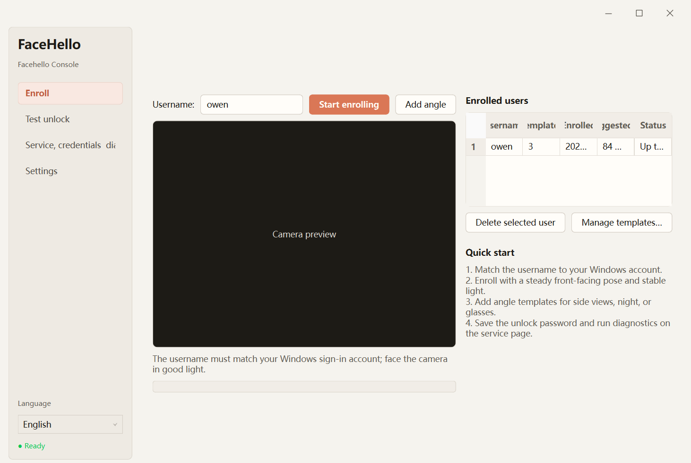
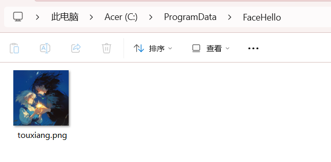

<div align="center">

 


*面向不支持 Windows Hello 的笔记本、台式电脑前置摄像头 / USB 摄像头。*

*灵感源于作者拥有过的一台 Surface Pro 4 便携平板~*

<br>

[](https://www.microsoft.com/windows)
[](https://www.python.org)
[](./LICENSE)
[](https://github.com/deepinsight/insightface)
[](https://developers.google.com/mediapipe)

**[🇬🇧 English](./README.md)**　｜　**[📐 设计与技术决策](./DESIGN_zh.md)**

</div>

---

## ⚠️ 使用前安全须知   

- 该项目仅考虑在**Windows10、11**系统上使用，不推荐在其他任何操作系统上使用该项目。   
- 项目涉及修改Windows服务等影响系统的操作，作者虽然已经加入大量安全保护也已经进行了实机验证，但仍有可能存在**无法登录、服务宕机、电脑蓝屏**等严重系统问题，虽然这些情况出现概率极小，但仍需注意。  
- 本项目使用OpenCV等视觉算法实现单RGB摄像头人脸识别解锁功能，也就是**类 Windows Hello**，但实际安全性远低于原版Windows Hello。单RGB摄像头不能像红外摄像头、深度摄像头感知空间信息，面对高质量视频、图片极有可能绕过安全检查进入系统。**请勿在存储敏感数据的工作电脑**使用该项目，存在极大风险，如造成巨大损失需个人自行承担后果。   
- 本项目视觉识别调用onnx模型在CPU上进行推理，对电脑硬件有一定要求，根据测试，不建议4核以下的CPU使用该项目，推理延迟将会明显提升，有违Windows hello原版快速解锁的初衷。  

---
## 💽网盘分发   

夸克网盘：   
链接：https://pan.quark.cn/s/db1464cf9c2d?pwd=afnw       
提取码：afnw     

---    

## 📋 环境要求

- **Windows 10 / 11(x64)**
- 一个可用的 **RGB 摄像头**
- **4 核及以上 CPU**:识别在 CPU 上跑 onnx 推理,核心太少解锁延迟会明显变大,有违快速解锁的初衷
- 部分进阶功能(写 LSA 密码、装服务)需要**管理员**终端(PowerShell)

---

## 🚀 安装与使用(推荐:一键安装包)

普通用户不需要装 Python / uv,在Release界面下载提供的安装包即可

1. 到 [Releases](https://github.com/everglow01/Windows-Face-Hello/releases) 下载最新版的 `FaceHello-Setup-x.y.z.exe`。
2. 右键**以管理员身份运行**,跟着中文向导完成安装。安装器会注册后台认证服务和锁屏凭据提供程序，并创建数据目录。安装结束前还会自动检查服务及其有限 SCM 恢复策略、管道、当前版本 DLL、日志和人脸库；验收失败时不会静默完成安装。
3. 装好后从开始菜单或桌面打开「FaceHello 管理台」(初次请用管理员权限),录入人脸、设好登录密码,就能在锁屏用脸解锁了。

> 正式版本使用项目固定的个人自签名证书。首次安装时 Windows 仍可能提示“未知发布者”；用户批准 UAC 后，安装器会先将内置公钥证书与固定 signer pin 比对，通过后才写入本机信任库。PFX 私钥不会进入仓库、安装包、构建产物或 GitHub Release。

> 识别模型已经全部打包进安装包,安装过程无需联网下载。
>
> 后续版本可在管理台检查更新。下载支持断点续传，安装前会再次校验版本信息、SHA-256 和签名。升级会保留人脸库，并在完成前自动比较升级前后的数据和系统登录组件；如果配置或验收失败，安装器会尝试恢复上一版本。安装不会静默进行，也不会自动重启 Windows。

**卸载**:从 Windows「设置 → 应用」或开始菜单里的「卸载 FaceHello」即可完成卸载，卸载包括软件本地和所有本地数据，不留任何残余文件在本地。

---

## 🛠️ 开发环境    

想通过源码运行控制台和服务、或者参与开发的话:

- **Python 3.11**(项目要求 `>=3.10,<3.12`)
- [**uv**](https://docs.astral.sh/uv/)(包 / 虚拟环境管理)

```powershell
git clone https://github.com/everglow01/Windows-Face-Hello.git
cd Windows-Face-Hello

uv sync                                   # 创建 .venv 并安装依赖(非 base 环境)
uv run python scripts/offline_check.py    # 离线自检(不需摄像头/显示器),全 [ok] 即正常
uv run python -m app.main                 # 启动管理台 GUI（初次使用必须使用管理员权限）
```

> 首次运行会自动下载模型到 `models/`:InsightFace `buffalo_l`(识别 + 检测,约 191MB)、MediaPipe `face_landmarker.task`(活体,约 3.7MB)。    

详细的开发者文档以及contribute指南见[contribute_zh.md](./contribute_zh.md)

---

## 🖥️ 管理台 GUI 使用介绍

以管理员权限启动安装好的应用即可进入管理台。窗口首次打开时会按内容调整到合适大小，也可以从边缘或四角继续缩放；摄像头预览会随窗口大小调整并保持画面比例：



1. **录入** — 用户名默认填当前 Windows 账户名（即电脑锁屏界面显示的文字）;正对摄像头采集若干合格帧,取平均特征作为模板。已录入用户的查看 / 删除也在本页。
   > 用户名必须等于你的 Windows 登录账户名,锁屏解锁才能对上(微软账户走本地登录名)。
   >不清楚账户名可以Win+L查看锁屏界面显示的用户名称，一般来说二者一样
   > 💡 **建议:同一用户多录几条模板。** 首次「开始录入」后,换不同**角度、光照、妆容 / 发型、戴不戴眼镜**等场景,点「**补录角度**」按钮各补录一条(同一用户名下可存多条模板,解锁时自动取最相似的一条)。录 **2 条以上**能明显提升不同场景下的解锁成功率、减少偶发刷不开。可在「设置」页调每人模板上限。
2. **测试解锁** — 按提示完成随机活体动作(眨眼 N 次 / 向左 / 向右转头),通过后做识别比对,显示相似度与结果。
3. **设置** — 选择摄像头(带「测试」按钮预览所选那台,多摄像头机器很有用);调匹配阈值、转头角度、眨眼次数和建议重新录入周期;开关「活体检测」与「被动反欺骗」。还可以暂停刷脸而不删除数据，分别控制 Windows 登录与工作站解锁(`Win+L`)，或按需开启「多人保护」；多人保护默认关闭。到期只会提醒重新录入，原模板仍可正常认证。
4. **服务、凭据与诊断** — 设置锁屏解锁要用的登录密码(写入 LSA Secret)、一键安装 / 启停认证服务，并检查服务版本、管道协议和运行状态。本页可以查看最近 200 行服务日志、打开日志目录，并导出脱敏诊断 ZIP。**需管理员权限**,否则相关按钮置灰。

*初次进行录脸和测试会出现卡顿，属正常现象。*    

*GUI界面右下角将显示模型加载状况，建议稍作等待等模型加载完成后再进行人脸录入和识别测试。*  

如需标定活体阈值(实时显示 EAR / yaw,退出给建议值):

```powershell
uv run python -m scripts.liveness_tune
```

---

## 🔓 锁屏解锁实现

完整解锁链路:锁屏「Face Unlock」磁贴 →(命名管道)→ LocalSystem 系统服务 → InsightFace 识别 → 读取 LSA 中保存的密码 → 打包 Kerberos 凭据真解锁。本地账户与微软账户(MSA 本地登录)均已端到端验证。**在作者实体机上已得到完整验证可用。**

刷脸总开关和两个场景开关决定磁贴是否出现在开机/注销登录或工作站解锁中。关闭开关只隐藏对应场景的 FaceHello，不删除人脸模板、设置或 LSA 凭据。Windows 10 及更高版本可能把两种情况都报告为 `CPUS_LOGON`，因此 CP 还会判断当前 WTS 会话是否已有登录用户；如果无法判断且只启用了一个场景，FaceHello 会保持隐藏，不越过用户设定的范围。

> 刷脸失败时,按磁贴上的 **→** 按钮可再试一次——共 **3 次**机会,用尽后回退到密码登录(系统密码 / PIN 始终保留)。

认证服务的命令(管理员;`<venv>` = `.venv\Scripts\python.exe`):

```powershell
<venv> winservice_main.py install --startup auto   # 注册系统服务并设开机自启
<venv> winservice_main.py start | stop | remove     # 起 / 停 / 删
```
上述命令一般不用手动执行，管理台可以一键安装和启动；这里仅供开发调试。安装器还会配置有限 SCM 异常恢复：第一次异常停止后 60 秒重启，第二次 120 秒重启，第三次起不再重试，24 小时无新失败后重置计数。管理员正常停止服务不会触发自动拉起。

如果你是从源码开发、想自己编译锁屏磁贴那块的 C++ 凭据提供程序(CP),需要 VS2022 并勾选「使用 C++ 的桌面开发」,**用 PowerShell 编译**:

```powershell
MSBuild.exe cp\FaceHelloCP.sln /p:Configuration=Release /p:Platform=x64
# 产物在 cp\x64\Release\FaceHelloCP.dll,再用 regsvr32 注册
```

> ⚠️ 注册 CP、真机测试前**务必**先打系统还原点或 VM 快照,并留一个备用管理员账户。FaceHello 只新增磁贴，绝不替换或过滤系统密码/PIN Provider；更多构建与排错细节见 [cp/README_zh.md](./cp/README_zh.md)。


---

## ⚙️ 工作原理(简述)

```
摄像头(OpenCV) → 主动活体(MediaPipe FaceLandmarker:EAR 眨眼 + solvePnP 转头)
              → 人脸检测 + 识别(InsightFace SCRFD + ArcFace,512 维特征)
              → 被动反欺骗(Silent-Face MiniFASNet:拒绝屏幕 / 照片 / 视频回放)
              → 余弦相似度比对人脸库 → 通过 / 拒绝
```

- 核心库 `face_hello/` 无 GUI 依赖,被管理台、服务、脚本共用。
- 锁屏场景下,识别在常驻的 LocalSystem 服务里完成;C++ 凭据提供程序只负责 UI 与提交凭据,二者通过本地命名管道通信。

---  

## 🖼️ 自定义锁屏界面头像

你可以在默认路径 `C:\ProgramData\FaceHello` 下放一张自己的头像图片。程序会取这个目录下的**第一张**图片,缩放裁切成正方形贴到锁屏磁贴上。

- 支持 **PNG / JPG / BMP** 格式,建议直接放一张正方形图,免得边缘被裁掉。
- 纯 ASCII 路径——锁屏下以 SYSTEM 身份运行的凭据提供程序才读得到
- 读不到图片或解码失败时,磁贴会自动回退成默认的纯蓝色占位图,不影响解锁功能。



## 🔐 安全与隐私

- 人脸库存的是**特征向量,不是照片**,使用 Windows DPAPI 加密后保存在本地 `data/`,不会上传到云端。带版本的存储格式会在读取时校验，保存时使用原子替换，减少写入中断造成数据损坏的可能。
- 登录密码保存在 **LSA Secret**,由凭据提供程序在 SYSTEM 上下文自行读取,**永不经过进程间通信**。
- 被动反欺骗(Silent-Face MiniFASNet)会在识别阶段采样多帧，用于拒绝屏幕、照片和视频回放。默认开启，可在设置中关闭；RGB 单目仍不能提供与红外 / 深度相同的防护。
- 可选的「多人保护」会在检测到两张或更多人脸时，于身份比对前拒绝本次认证。该功能默认关闭，因为背景中的旁人、屏幕、海报或远处人脸可能造成误拒；启用后，多人拒绝会占用磁贴的三次刷脸机会之一。
- 诊断 ZIP 采用固定白名单，只包含诊断报告和滚动服务日志。导出时会遮蔽用户名和疑似凭据赋值，不包含 `faces.dat`、密码、LSA Secret、人脸模板或原始摄像头画面。
- 即使同时启用主动活体和被动反欺骗，RGB 单目仍可能被高质量回放绕过。**不要在可能被他人接触、又保存敏感数据的电脑上使用本项目。**
- 关闭**活体检测**后启动更快，但照片攻击门槛会明显降低，不建议关闭。

---

## 📂 目录结构

```
face_hello/        核心库(无 Qt 依赖)
  camera.py          摄像头采集(带冷启动 / 唤醒重试)
  detector.py        InsightFace 检测 + 512 维特征
  matcher.py         余弦相似度比对
  liveness.py        FaceLandmarker → EAR 眨眼 + solvePnP 转头 + 随机挑战
  enroll.py          多帧平均特征录入
  store.py           DPAPI 加密人脸库 + 设置
  auth.py            认证编排(活体 → 识别)状态机
  service.py         命名管道认证服务端
  win_service.py     LocalSystem 服务封装 + 有限 SCM 恢复策略
  diagnostics.py     服务日志查看 + 脱敏诊断 ZIP 导出
  probes.py          服务 / 管道 / 模型 / 摄像头共用探针
  updater.py         更新清单、断点下载与校验
  cred_vault.py      LSA Secret 读写(登录密码)
app/               PySide6 管理台(main.py + 后台 workers.py)
cp/                C++ Credential Provider(锁屏磁贴,需 VS 编译)
scripts/           offline_check.py 等工具脚本
data/              加密人脸库(gitignored)
models/            模型权重(gitignored)
```

---

## 🚧 已知限制

- 防伪能力受限于 RGB 单目(见上文安全说明)，可能存在被有心之人通过不法手段绕过的可能，再次强调，请不要在存放敏感数据的电脑上使用。
- 首次冷启动需要从磁盘加载识别模型，会有数秒开销。摄像头通过 DSHOW 退避重试，并在认证前确认能够读取一帧。v1.0.6 已完成短时和长时睡眠恢复的真机验收；休眠、合盖、快速启动、摄像头占用后释放及 Windows 更新后首次解锁仍属于硬件相关验收项。
- 工作目录含中文路径时,已对 OpenCV / MediaPipe 做特殊处理,但仍可能存在编码错乱问题。
- 安装包体积和应用本体体积受限于Python相关依赖包，体积较大

---   

## ❓ 常见问题 Q&A    
**Q：为什么锁屏、冷启动或睡眠恢复后的刷脸可能变慢或失败？**

A：有些摄像头离开桌面会话后需要几秒重新供电或枚举。FaceHello 会重试 DSHOW 打开操作，并在继续认证前确认能读到一帧；摄像头固件、省电设置、隐私权限或其他程序占用仍可能造成延迟或失败。当前短时和长时睡眠已经通过真机验收。如果问题反复出现，先用密码/PIN 登录，再从管理台导出脱敏诊断 ZIP；提交 issue 时附测试时间、摄像头型号和驱动版本。

**Q：在锁屏界面显示“未启动服务”，无法使用刷脸解锁**

A：以管理员身份进入管理台，在“服务、凭据与诊断”页查看服务状态。若服务没有运行，可以直接启动；若显示“正在运行”但锁屏仍报错，先运行诊断并查看本页最近的服务日志。诊断会区分服务未就绪、版本不一致、协议不兼容和响应异常。导出的诊断 ZIP 会遮蔽用户名和疑似凭据值，也不会包含人脸库。提交 issue 时可以附上该 ZIP 和运行环境，但不要上传密码、LSA Secret 或 `faces.dat`。

**Q：为什么第一次刷脸失败，第二次又能恢复？**

A：先查看最近服务日志中的摄像头打开重试、取帧失败和解锁计时。服务每次认证都会重新打开摄像头，但会复用已经预热的活体 tracker。不要预先认定所有恢复失败都来自同一原因；记录摄像头是否就绪、是否出现活体提示、服务是否仍在运行。需要时先用密码/PIN 登录，并在重启服务前导出诊断资料。

**Q：Windows 更新后无法使用 FaceHello，应该怎么办？**

A：先用密码/PIN 登录，再以管理员身份打开管理台并运行诊断。确认服务正在运行、ImagePath 指向当前安装目录、管道版本和协议匹配、当前版本 Credential Provider DLL 已注册。Windows 更新后的恢复仍是专项验收场景；服务挂起不视为正常现象，也不能假定下一次锁屏会自行恢复。

**Q：检查更新失败时，为什么会出现不同提示？**

A：管理台会区分“已经是最新版本”、本地网络不可用、GitHub 暂时异常或限流、发布信息无效、更新清单不兼容、磁盘空间不足、下载响应异常、安装包哈希 / 签名校验失败以及下载被暂停。按提示处理即可；校验失败的安装包不会继续安装。

**Q：升级时会清空已录入的人脸吗？**

A：正常升级会保留 `C:\ProgramData\FaceHello\data` 下的人脸库。安装器会在改动服务和锁屏组件前保存仅含哈希与计数的临时基线，升级后自动比较；基线不包含用户名、人脸特征、Windows 密码或 LSA Secret。验收成功后会删除基线，失败时保留它并尝试恢复上一版本。

## 📝 后续可选工作

- 完成休眠、合盖、快速启动、摄像头占用后释放及 Windows 更新后首次解锁的硬件验收；没有稳定复现前，不调整摄像头或 tracker 生命周期。
- 评估 GPU / NPU 推理，并保留可靠的 CPU 回退和 Session 0 兼容性。
- 单独验证进一步裁剪依赖的收益；每次改动都要通过 offline check、release smoke、完整 pytest 和安装态验收。
- 研究更低打扰的被动活体，但在完成回放攻击测试前不替换现有主动挑战。

## 📄 许可证
Apache-2.0(见 LICENSE);因捆绑的 InsightFace 模型仅限非商业,发行版为非商业用途,详见 THIRD_PARTY_LICENSES.md    
